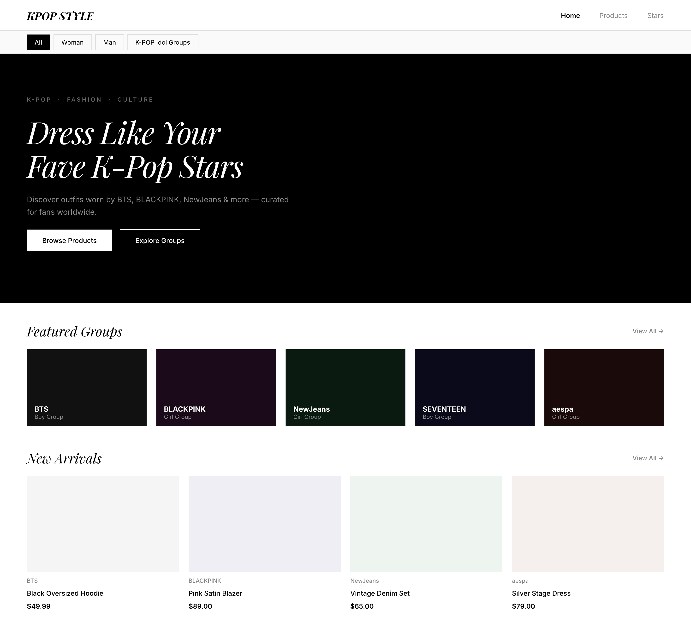
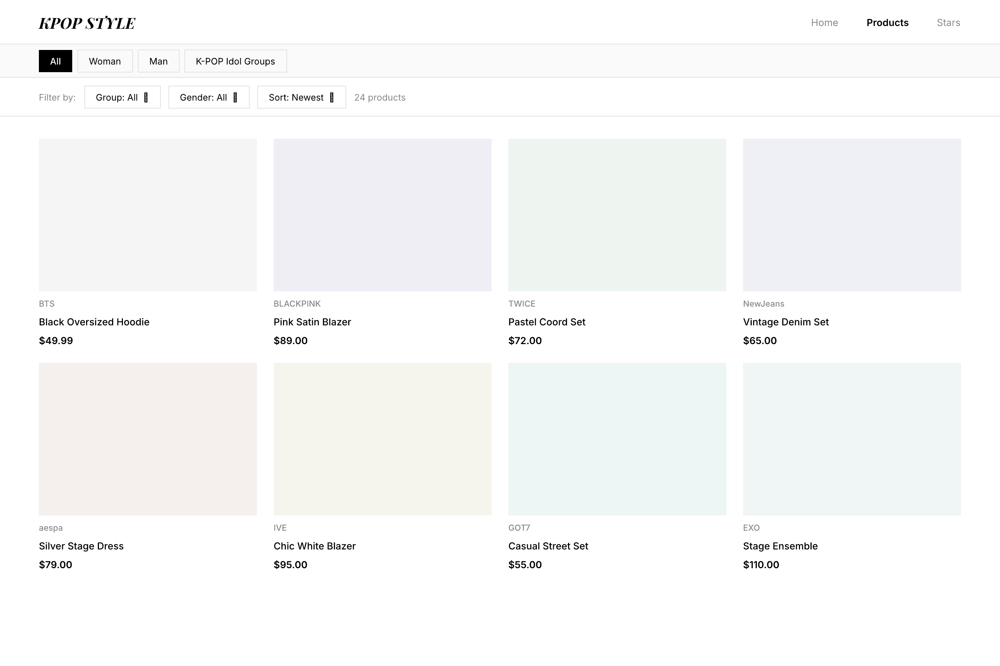
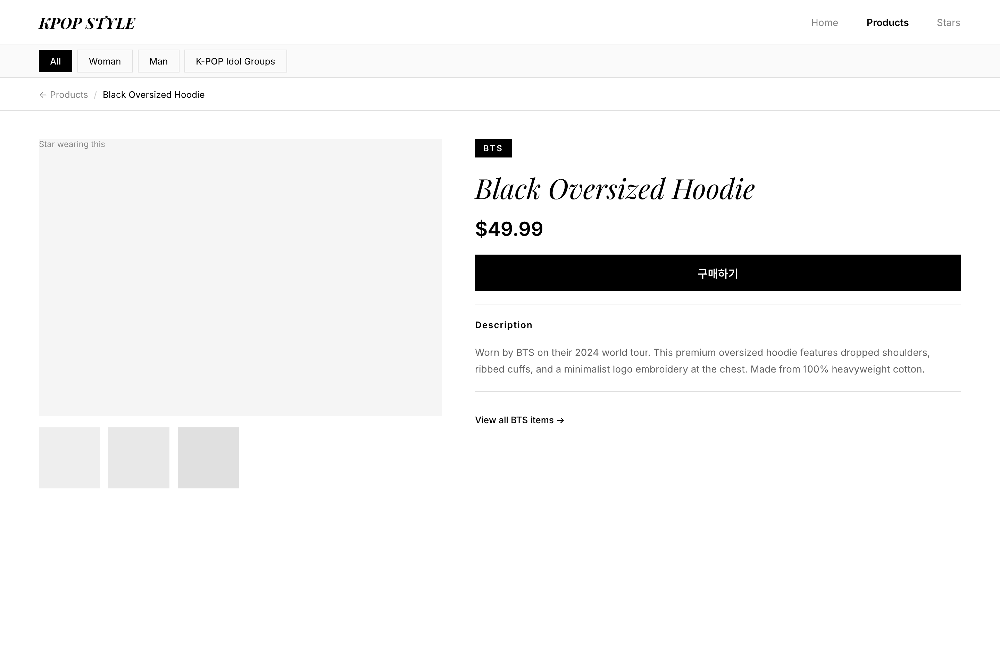
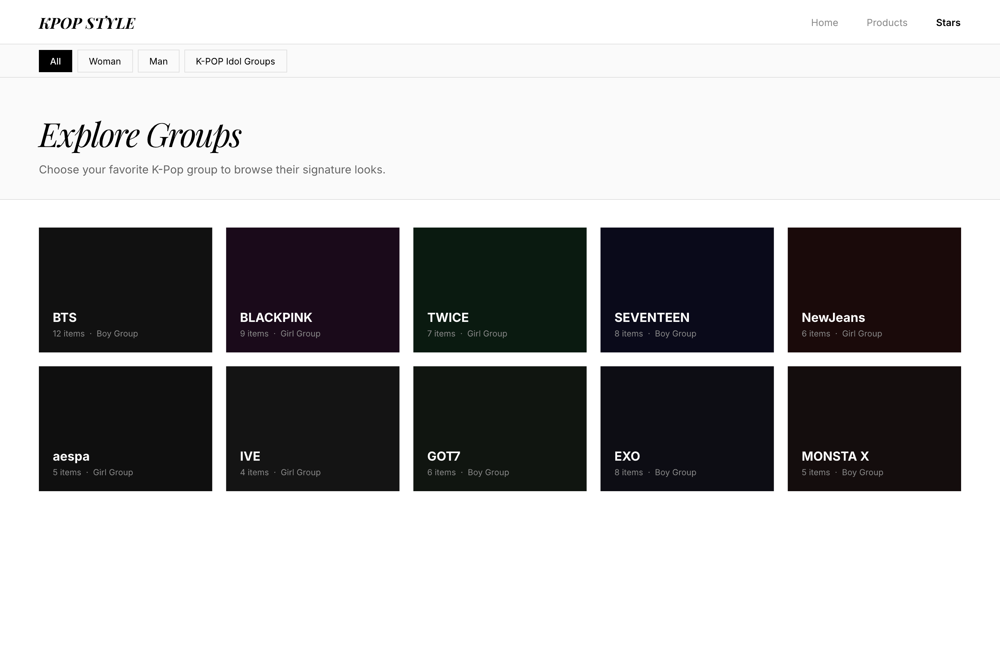

# K-Pop 스타 코디 쇼핑몰 — PRD (Product Requirements Document)

## 1. 프로젝트 개요

K-Pop 아이돌 그룹이 착용한 의류를 소싱하여 외국 팬들에게 소개하는 전문 쇼핑 레퍼런스 사이트.
그룹 이름으로 상품을 탐색하고, 실제 착용 사진과 함께 상품 정보를 확인할 수 있다.
MVP에서 결제/구매 링크는 제외하며, 착용 레퍼런스 + 상품 정보 제공에 집중한다.

## 2. 사용자 페르소나

**Emma, 22세, 미국 대학생**
- BTS와 BLACKPINK를 좋아하는 K-Pop 팬
- 좋아하는 그룹이 무대에서 입었던 옷 스타일을 찾고 싶다
- 영어 UI 선호, 모바일로 주로 탐색

**관리자 (사이트 운영자 1명)**
- 상품을 직접 소싱하여 등록/관리
- 그룹 정보와 착용 사진을 함께 업로드

## 3. K-Pop 그룹 카탈로그 (상위 10개)

| 성별 | 그룹 |
|------|------|
| Boy Group | BTS, EXO, SEVENTEEN, MONSTA X, GOT7 |
| Girl Group | BLACKPINK, TWICE, NewJeans, aespa, IVE |

## 4. 핵심 기능 상세

### 4.1 상품 목록 (Product List)

**사용자 스토리**: K-Pop 팬으로서, 그룹별·성별로 상품을 필터링하여 원하는 스타일을 빠르게 찾고 싶다

**화면**: `/products` — 상품 목록 페이지

**동작 흐름**:
1. 상품 카드 그리드(3~4열) 렌더링
2. 상단 필터 바: 그룹 선택, 성별, 가격 정렬, 신규순 정렬
3. 필터 선택 시 즉시 상품 목록 갱신 (클라이언트 사이드 필터링)
4. 카드 클릭 시 상품 상세 페이지 이동

**상품 카드 구성**:
- 상품 대표 이미지
- 그룹명 (예: BTS)
- 상품명 (예: Black Oversized Hoodie)
- 가격 (예: $49.99)

**필터/정렬 옵션**:
- 그룹: All / BTS / BLACKPINK / TWICE / … (10개 그룹)
- 성별: All / Boy Group / Girl Group
- 정렬: Newest / Price: Low to High / Price: High to Low

**예외 처리**:
- 필터 결과 없으면 "No products found" 메시지 표시
- 이미지 로드 실패 시 placeholder 이미지 표시

**우선순위**: Must-have

---

### 4.2 상품 상세 (Product Detail)

**사용자 스토리**: 팬으로서, 그룹이 실제 착용한 사진과 상품 정보를 함께 보고 싶다

**화면**: `/products/[id]` — 상품 상세 페이지

**동작 흐름**:
1. 상단: 착용 스타 사진 (관리자가 업로드)
2. 중단: 상품 사진 (1~5장), 상품명, 그룹명, 가격, 설명
3. 하단: 같은 그룹의 다른 상품 추천 (최대 4개)

**표시 데이터**:
- 그룹명
- 상품명
- 가격
- 상품 설명 (자유 텍스트)
- 착용 사진 (스타 착용 이미지, 1~3장)
- 상품 사진 (1~5장)

**예외 처리**:
- 존재하지 않는 상품 ID → 404 페이지
- 이미지 없으면 placeholder 표시

**우선순위**: Must-have

---

### 4.3 Stars 탐색 페이지 (Group Catalog)

**사용자 스토리**: 팬으로서, 내가 좋아하는 그룹 카드를 클릭해서 그 그룹 관련 상품만 바로 보고 싶다

**화면**: `/stars` — 그룹 목록 페이지

**동작 흐름**:
1. 그룹 카드 그리드 표시 (그룹 대표 이미지 + 그룹명)
2. 카드 클릭 → `/products?group={그룹명}` 로 이동 (해당 그룹 필터 적용)

**그룹 카드 구성**:
- 그룹 대표 이미지
- 그룹명
- 등록된 상품 수 (예: "12 items")

**예외 처리**:
- 상품이 없는 그룹도 카드는 표시 ("0 items")

**우선순위**: Must-have

---

### 4.4 성별 카테고리 (Gender Category)

**사용자 스토리**: 팬으로서, 보이 그룹 / 걸 그룹으로 빠르게 구분하여 탐색하고 싶다

**구현 방식**: 별도 페이지 없이 상품 목록 필터의 성별 옵션 (Boy Group / Girl Group)으로 처리

**우선순위**: Must-have (필터로 통합)

---

### 4.5 관리자 페이지 (Admin)

**사용자 스토리**: 운영자로서, 상품과 그룹 정보를 쉽게 등록/수정/삭제하고 싶다

**화면**: `/admin` — 관리자 대시보드

**인증**:
- 고정 ID/PW (환경변수 `ADMIN_ID`, `ADMIN_PASSWORD`)
- `/admin/login` 페이지에서 로그인, 세션 쿠키 발급
- 인증 미완료 시 `/admin/login` 리다이렉트

**관리자 기능**:

| 기능 | 경로 | 설명 |
|------|------|------|
| 상품 목록 | `/admin/products` | 전체 상품 조회, 삭제 |
| 상품 등록 | `/admin/products/new` | 상품 정보 + 이미지 업로드 |
| 상품 수정 | `/admin/products/[id]/edit` | 기존 상품 정보 수정 |
| 그룹 목록 | `/admin/stars` | 전체 그룹 조회 |
| 그룹 등록 | `/admin/stars/new` | 그룹 이름, 성별, 대표 이미지 등록 |
| 그룹 수정 | `/admin/stars/[id]/edit` | 그룹 정보 수정 |

**상품 등록 폼 필드**:
- 그룹 선택 (dropdown)
- 상품명
- 가격
- 상품 설명
- 착용 사진 업로드 (최대 3장)
- 상품 사진 업로드 (최대 5장)

**예외 처리**:
- 필수 항목 누락 시 폼 유효성 검사 오류 표시
- 이미지 업로드 실패 시 오류 메시지

**우선순위**: Must-have

---

## 5. 화면 목록

| # | 화면명 | 경로 | 설명 | 프로토타입 |
|---|--------|------|------|-----------|
| 1 | 홈 | `/` | 신규 상품 하이라이트, 그룹 카탈로그 진입 |  |
| 2 | 상품 목록 | `/products` | 필터/정렬 포함 전체 상품 그리드 |  |
| 3 | 상품 상세 | `/products/[id]` | 착용 사진 + 상품 정보 |  |
| 4 | Stars 탐색 | `/stars` | 그룹 카드 목록 |  |
| 5 | 관리자 로그인 | `/admin/login` | 고정 ID/PW 입력 | — |
| 6 | 관리자 대시보드 | `/admin` | 상품/그룹 관리 진입점 | — |
| 7 | 관리자 상품 목록 | `/admin/products` | 상품 CRUD | — |
| 8 | 관리자 상품 등록/수정 | `/admin/products/new`, `/admin/products/[id]/edit` | 상품 폼 | — |
| 9 | 관리자 그룹 목록 | `/admin/stars` | 그룹 CRUD | — |
| 10 | 관리자 그룹 등록/수정 | `/admin/stars/new`, `/admin/stars/[id]/edit` | 그룹 폼 | — |

---

## 6. 데이터 모델

| 모델 | 주요 필드 | 관계 |
|------|----------|------|
| `Star` (그룹) | `id`, `name`, `gender` (BOY/GIRL), `imageUrl`, `createdAt` | has many Products |
| `Product` | `id`, `name`, `price`, `description`, `starId`, `createdAt` | belongs to Star, has many ProductImages |
| `ProductImage` | `id`, `productId`, `url`, `type` (STAR_WEARING/PRODUCT), `order` | belongs to Product |

---

## 7. API 엔드포인트 초안

| Method | Path | 설명 |
|--------|------|------|
| `GET` | `/api/products` | 상품 목록 (쿼리: `group`, `gender`, `sort`) |
| `GET` | `/api/products/[id]` | 상품 상세 |
| `POST` | `/api/products` | 상품 등록 (관리자) |
| `PUT` | `/api/products/[id]` | 상품 수정 (관리자) |
| `DELETE` | `/api/products/[id]` | 상품 삭제 (관리자) |
| `GET` | `/api/stars` | 그룹 목록 |
| `POST` | `/api/stars` | 그룹 등록 (관리자) |
| `PUT` | `/api/stars/[id]` | 그룹 수정 (관리자) |
| `DELETE` | `/api/stars/[id]` | 그룹 삭제 (관리자) |
| `POST` | `/api/upload` | 이미지 업로드 (관리자) |
| `POST` | `/api/admin/login` | 관리자 로그인 |
| `POST` | `/api/admin/logout` | 관리자 로그아웃 |

---

## 8. 구현 우선순위

### Phase 1 (MVP)
- [ ] DB 스키마 (Star, Product, ProductImage)
- [ ] 관리자 인증 (고정 ID/PW, 세션)
- [ ] 관리자 그룹 CRUD + 이미지 업로드
- [ ] 관리자 상품 CRUD + 이미지 업로드
- [ ] 상품 목록 페이지 (필터/정렬)
- [ ] 상품 상세 페이지
- [ ] Stars 탐색 페이지

### Phase 2 (이후 추가)
- [ ] 구매 링크 (외부 쇼핑몰 URL 연결)
- [ ] K-Drama 배우 카테고리
- [ ] 상품 검색 (키워드)
- [ ] 모바일 최적화 상세 작업

---

## 9. 제외 범위 (MVP)

- 결제 / 장바구니
- 회원가입 / 고객 마이페이지
- 리뷰 / 평점
- 외부 구매 링크
- K-Drama 배우 카테고리
